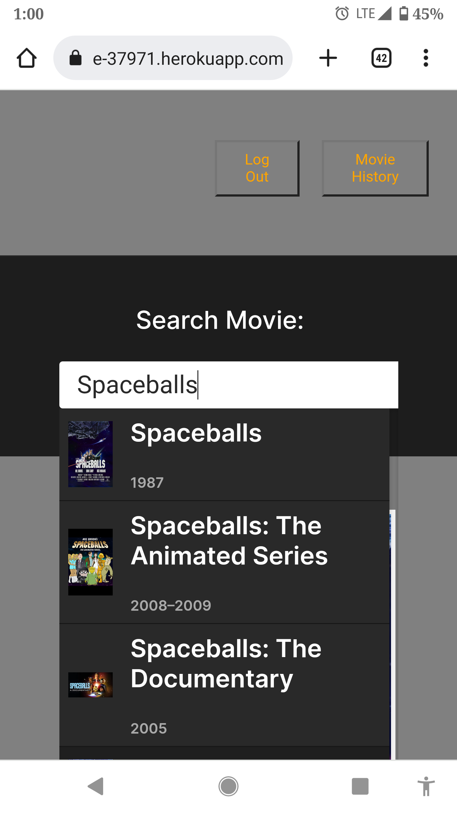
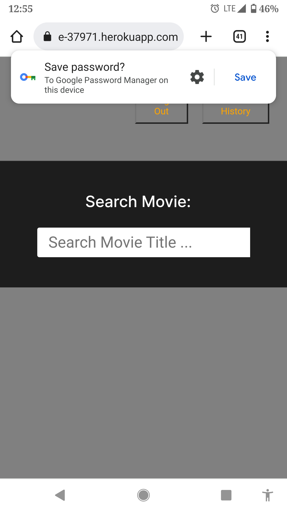

# Box Office Crash:

## Description

The application Box Office Crash is created for an entertaining movie game application where users will have fun to play and use it. We as a team all come up with an ideas to create this application in order to achieve users attention and to have a successful project goal. This project helped us to use our skills we learnt in frontend development practices and has been fully created from scratch.

## Installation

In order the run this application we require to use the (imdb and omdb ) movie database Application programming interface(Api) and libaries to build this apps more efficiently.

Click the link to load the application:
https://peaceful-hamlet-04081.herokuapp.com/login

## Usage

Once loading the webpage you will be prompt with two movies selection you want to use then click on the button for the specific game you wish to play. the two different movies you can select if the 2nd movie is higher or lower than the first one depending on the game type such as box office amount or ratings.If you guess correct then the game progresses where the 2nd movie gets compared to the next new movie that is loaded in. Game continues until you guess incorrectly which will take you to another page with your score and status.

## Mock

The following images show the feature of the application.

## License

This project is license under MIT

## Badges

## Questions

If you have any questions about this projects, please contact us directly at below links.

-[Github]('https://github.com/OmerMasih')   -[Github]('https://github.com/mdawood11/mdawood11')

[Github] ('https://github.com/gdutra2002')

### This project is created by Mohammad, Gary, Farid, Nicholas, Alan and Omer.👏🏻
